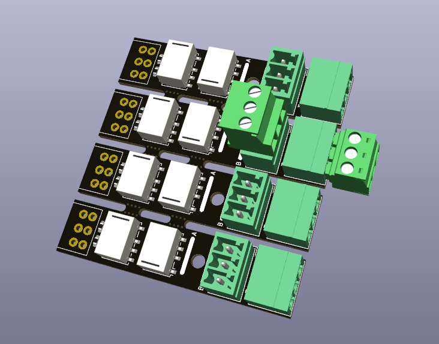
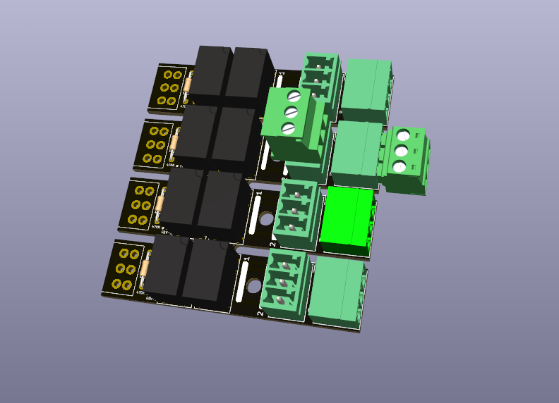

# Relay Extension

These are general-purpose relay modules for use with DCC decoders like the [OS-Solenoid-Decoder](https://github.com/Open-Source-Model-Railway-Electronics/OS-Solenoid-Decoder).

## Variants

### SMD Version

### THT Version

