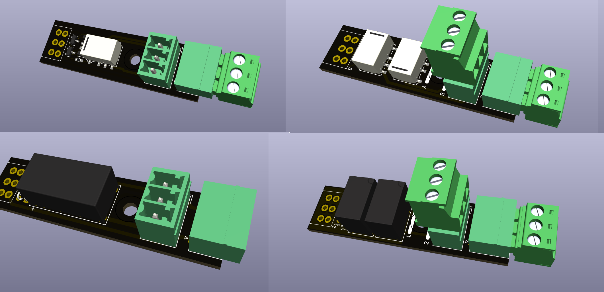
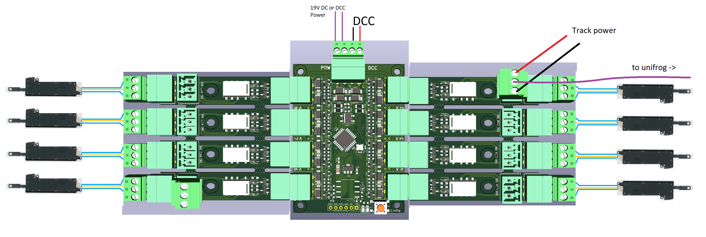
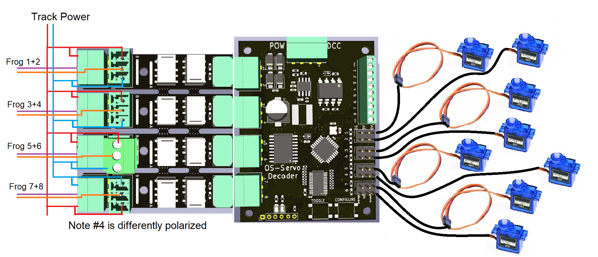

# OS Relay Modules Manual

## Introduction

This document describes the OS relay modules used in Open Source Model
Railway Electronics projects: - **OS-General-Purpose-Relay** (dual relay
module) - **OS-Latching-Relay** (single bistable relay module)

Both relay types exist in **THT** and **SMD** versions and can be
plugged directly into OS decoders or be used standalone.

------------------------------------------------------------------------

## 1. OS-General-Purpose-Relay

The OS-General-Purpose-Relay module contains **two mono stable relays**,
each with: - **1× Common (COM)** - **1× Normally Open (NO)** - **1×
Normally Closed (NC)**

*Contacts of General Purpose Relays*

### Features

-   Compatible with **OS-Solenoid-Decoder** and **OS-Servo-Decoder**
-   Suitable for:
    -   Accessory switching (lights, signals, animations)
    -   **Electrofrog** turnout frog polarization
    -   **Unifrog** turnout frog polarization
    -   **Power routing sidings**

### Example Use Cases

-   Switching power to isolated track sections
-   Creating automated frog polarity switching
-   Controlling external electronics such as LEDs, bells, or motors
-   Power‑routing turnout configurations

------------------------------------------------------------------------

## 2. OS-Latching-Relay

The OS-Latching-Relay is a **single bistable (latching) relay**.\
It **remains in its last position without continuous power**.

### Important Notes

-   Cannot be used for **electrofrog** turnouts\
    (electrofrog requires a continuous, non‑latching polarity change)
-   Works perfectly with **unifrog** turnouts
-   The relay coil can be connected **in parallel** with the turnout
    solenoid coil, it does not require extra decoders

### Use Cases with DCC Decoders

-   **Unifrog frog polarization**
-   Self‑thinking turnouts / power‑routing
-   Accessory switching
-   Standalone operation with any solenoid decoder

------------------------------------------------------------------------

## 3. Using the Relays with OS Decoders

### With OS-Solenoid-Decoder

-   Supports both:
    -   OS-General-Purpose-Relay\
    -   OS-Latching-Relay (for unifrog only)

### With OS-Servo-Decoder

-   Supports only:
    -   **OS-General-Purpose-Relay**
-   Typical uses:
    -   Frog polarity switching
    -   Accessory switching

------------------------------------------------------------------------

## 4. Standalone Usage

Both relay modules can be used without OS decoders.

### Requirements

-   A 5V logic-level control signal
-   Power supply appropriate to the relay type
-   Any microcontroller, Arduino, or third‑party decoder capable of
    driving a small relay

### Typical Standalone Applications

-   Switching LEDs or signals
-   Power routing in sidings
-   Controlling frog polarity in turnout modules
-   Low‑current automation tasks

------------------------------------------------------------------------

## Summary Table

## Summary Table

| Relay Type                 | Unifrog | Electrofrog | Accessory Switching | Self-Thinking Sidings | Works With               |
|---------------------------|---------|-------------|----------------------|------------------------|--------------------------|
| **OS-General-Purpose-Relay** | ✔       | ✔           | ✔                    | ✔                      | Servo + Solenoid Decoders |
| **OS-Latching-Relay**        | ✔       | ✖           | ✔                    | ✔                      | Solenoid Decoders Only     |

------------------------------------------------------------------------

## Wiring Examples

Illustrations of typical wiring setups can be found in the project
repository and the OS decoder manuals.

*OS-Solenoid decoder with 8 OS-latching-relays plugged in*

*OS-General-Purpose relay wired to OS-Solenoid-Decoder for electrofrog points*

*OS-General-Purpose relay connected to OS-Servo-Decoder for unifrog points*

*OS-General-Purpose relay connected to OS-Servo-Decoder for electrofrog points*

## 5. Additional PCB ordering instructions

All OS-Relays have been designed so they can be ordered in so called panels. When they are ordered in panels, they have the same distances as the OS-decoder sockets. The PCBs can also be ordered as loose separated units, but as panels the PCBs are cheaper per unit.

To order them as a panel. You need to click on **Panel by JLCPCB** behind **Delivery format**. This will open a new window where you have to set the amount of colomns and rows. There are 2 rules:

- JLCPCB demands that panels need to be bigger than 70x70mm, the relays are around 50mm long and 15mm wide. 
- If they are to be used in combination with OS Solenoid or servo decoders. You want to have groups of 4 units, though this is not mandatory.

To meet the first demand you need atleast panels of 2 rows and 5 columns. To meet the second demand I recommend to increase to 8 colums. This essentially gives you 4 sets.

Whether you should order panels or loose PCBs also depends on how much you want. The minimum order amount is 5 units. So this can be 5 relays or it can be 5 panels of 10 - 16 relay modules each. You can always examine the price with shipping in the last cost, before paying. So you can stop your order at anytime. 

For further instruction about ordering PCBs look [here](https://github.com/Open-Source-Model-Railway-Electronics/docs/blob/master/Ordering_bare_PCB/Ordering_bare_PCB-EN.md) for bare boards and [here](https://github.com/Open-Source-Model-Railway-Electronics/docs/blob/master/Ordering_SMT_ASSEMBLED_PCB/Ordering_Assembled_PCBs_JLCPCB-EN.md) for SMT assembled boards